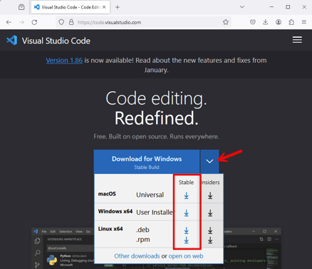
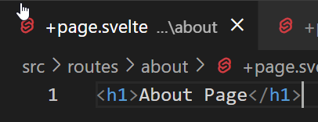

# Building the Project Web Application - Part 1: Getting Started 

Enda Lee 2024

## Introduction

The goal is to  to display data from **your** `Supabase` database in a web page. You will use a combination of `JavaScript`, `HTML`, and `CSS`. 

In order to simplify the process, we will be using a client-side framework called **SvelteKit**.

To get started we will use **SvelteKit** to build and serve a simple website.


## Pre-requisites

This tutorial continues from the previous ones, make sure that you:

1. Have setup a `Supabase` account and created the example database (Part 1).
2. Can insert to the database using an `MQTT script` and the `Supabase API` (Part 2).

3. Node.js and VS Code - these are installed on the lab PCs but see below if you need to install on a laptop, etc.

### Install Node.js

The client website needs to be hosted as web browsers enforce a `same origin policy` which can block access to data from external sources when a web page is not hosted opened directly.

Make sure that you have an up-to-date version of Node.js installed on your system. To check the current version (if installed), **open a console/ terminal** and then run **`node --version`**. You will see an error if Node.js is not currently installed.


o install or update Node.JS, download the current version from the **[nodejs.org website](https://nodejs.org/en/)**.


### Install VS Code

VS Code will be used to edit the web application. Download the latest stable version, for your OS,  from **https://code.visualstudio.com/**



When installing, make sure to choose the options to **open with code** in the explorer context menu.


## 1. Creating a new SvelteKit application

#### 1.1 Start by creating a folder for your application

Create the folder **in a location you will find later**. Then open the new **folder** it in VS Code. *Always open your site folder in VS code and not individual files!* (folders can also be opened from the file menu in VS Code)

for example:


Once open, you should see your app/ site folder name at the top  of the explorer window


#### 1.2 Create the Sveltekit web application

Open a `new terminal` from the **Terminal Menu** in VS Code.


1. Execute the following command in a VS Code terminal and press `enter` to create the application

```bash
npm create svelte@latest
```

You will be asked a series of question:

1. Choose a directory name: **leave blank and press enter to use the current directory**

2. New project template: Use the arrow keys (up/ down) and press enter to **choose the Skeleton Project**

3. Choose language: **Select JavaScript**

4. a) Choose whether to use ESlint: **Choose No for this example** (empty selection box)

   b) Choose whether to use Prettier formatting: **Choose Yes** (green filled selection box)

​	c) Testing options: **Choose No for this example**


The new SvelteKitapp is now created: run **npm install** and **npm run dev** to start it


8. Running the app


9. Open in a browser using **http://localhost:5173**


## 2. Examine the App structure

The home page served to the browser was generated from the **```\src\routes```** folder. The file **```routes\+page.svelte```** contains the home page. Note that this file naming scheme is a requirement  of the framework - if you don't follow this it will not work!!


### 2.1. Adding new page routes

 To add an **about** and **contact** page to the site, ad two new folders also named about and contact. Then add a new file to each folder named **+page.svelte** 


Add a H1 element to both pages to indicate the page content. Note that only html body content is required. The rest of the HTML page is loaded from **```src/app.html```**




### 2.2. Testing the new routes

Open the new page routs in a browser. You will see that the the page/ route names are derived from the names of the folders added to **```/src/routes/```**


## 3. Adding a navigation menu

A shared layout definition can be used to easily add navigation links to all the pages. Add **```+layout.svelte```** to the **routes** folder:


The navigation menu uses Bootstrap 5 for styling. Also note the **```<slot />```** element. This indicates where content from each page (about, contact, etc.) will be added when the page is generated by Sveltekit.

```html
<nav class="navbar navbar-expand-md bg-body-tertiary" data-bs-theme="dark">
	<div class="container-fluid">
		<a class="navbar-brand" href="/">Navbar</a>
		<button
			class="navbar-toggler"
			type="button"
			data-bs-toggle="collapse"
			data-bs-target="#navbarNavAltMarkup"
			aria-controls="navbarNavAltMarkup"
			aria-expanded="false"
			aria-label="Toggle navigation"
		>
			<span class="navbar-toggler-icon"></span>
		</button>
		<div class="collapse navbar-collapse" id="navbarNavAltMarkup">
			<div class="navbar-nav">
				<a class="nav-link" aria-current="page" href="/">Home</a>
				<a class="nav-link" href="/about">About</a>
				<a class="nav-link" href="/contact">Contact</a>
			</div>
		</div>
	</div>
</nav>
```


### 3.1. Bootstrap dependencies

These should be added to **```src/app.html```** so that they are loaded globally.

Get the latest CDN links from **https://getbootstrap.com/** and add them to the end of the `<body>` section of `app.html` ()


Copy from here:

```html
		<!-- Bootstrap CSS -->
		<link
			href="https://cdn.jsdelivr.net/npm/bootstrap@5.3.3/dist/css/bootstrap.min.css"
			rel="stylesheet"
			integrity="sha384-QWTKZyjpPEjISv5WaRU9OFeRpok6YctnYmDr5pNlyT2bRjXh0JMhjY6hW+ALEwIH"
			crossorigin="anonymous"/>
		<!-- Bootstrap Icons -->
		<link
			rel="stylesheet"
			href="https://cdn.jsdelivr.net/npm/bootstrap-icons@1.11.3/font/bootstrap-icons.min.css"/>

		<!-- Bootstrap JavaScript -->
		<script
			src="https://cdn.jsdelivr.net/npm/bootstrap@5.3.3/dist/js/bootstrap.bundle.min.js"
			integrity="sha384-YvpcrYf0tY3lHB60NNkmXc5s9fDVZLESaAA55NDzOxhy9GkcIdslK1eN7N6jIeHz"
			crossorigin="anonymous">
	  </script>
```


### 3.2 Test the Navigation

Save all open files and reload the app in your browser. You should now have working navigation.


## 4. Component variable example

Each **```.svelte```** page is a self contained component which can include its own script, style, and HTML content. This simple example shows how to define a variable and use it in the page.

 


Also notice how the CSS is only applied to the home page and not the others.


## 5. Event handling example

This example demonstrates event handling in the application.

1. A counter and a button will be added to the home page.
2. When the button is clicked, the counter will `increment`.
3. Another button `reset` will set `counter = 0`


1. A variable, named `counter` is used to keep track of the current value. Initially, when the page loads, its value is 0.

2. Two functions, `increment_counter()` and `reset_counter()` are used to update or reset the counter value.


#### Declare the variable and add the functions to the `script` section of the page.


#### Bind the variable and hancle click events in the page

1. Bind the counter value in an input field for display (or update).
2. Call the functions when the buttons are clicked.


## 6. Exercises

1. Add another button, and functuinality to decrement the counter (subtract 1 from the counter value when a button is clicked).
2. Use Bootstrap CSS tostyle the text input and buttons.


## 7. References

SvelteKit Docs: https://kit.svelte.dev/docs/introduction

Svelte Docs: https://svelte.dev/docs/introduction

Bootstrap 5: https://getbootstrap.com/docs/5.3/components/navbar/   


------

**Enda Lee 2024**
